# Auditoría visual + responsividad — CoachPro

**Objetivo:** evidencia real (screenshots + mediciones) para alimentar un rediseño. **No** hay cambios de estilo/layout en esta auditoría (solo la Parte 4 — fix del service worker — modifica código).

**Método:** app corriendo en local (`npm run dev`, http://localhost:5173) con datos reales de Supabase. Capturas headless con Playwright/Chromium a **390×844** (iPhone 17 Pro) y **360×844** (Android angosto), `deviceScaleFactor: 2`. Script: [`audit/run-audit.mjs`](audit/run-audit.mjs). Mediciones crudas: [`audit/measures.json`](audit/measures.json).

**Errores JS durante todo el recorrido:** `0`.

**Todas las capturas en una sola imagen:** [`audit/_all-screenshots.png`](audit/_all-screenshots.png) (contact sheet de las 13 pantallas × 2 anchos).

> ℹ️ **Actualización post-refinamiento (Fases 1 y 2 aplicadas).** Las capturas individuales y el contact sheet de abajo reflejan el estado **después** del refinamiento. El estado **antes** quedó preservado en [`audit/_all-screenshots-before.png`](audit/_all-screenshots-before.png).
>
> **Re-auditoría tras los cambios:** cero scroll horizontal en las 26 capturas (390/360px), touch targets nav 90×67px y botones de acción ≥44px, **0 errores JS**.
>
> Fixes Fase 1 (A1–A5): título+acción del detalle apilados · fila de búsqueda apilada · etiqueta de eje ya no se recorta · chat anclado al fondo · empty-state/tip en Rutinas.
> Refinamientos Fase 2 (B1–B5): jerarquía de Header · cards de atleta · anillos hero con glow · handle de sheet · pill activo en BottomNav · press state en cards.

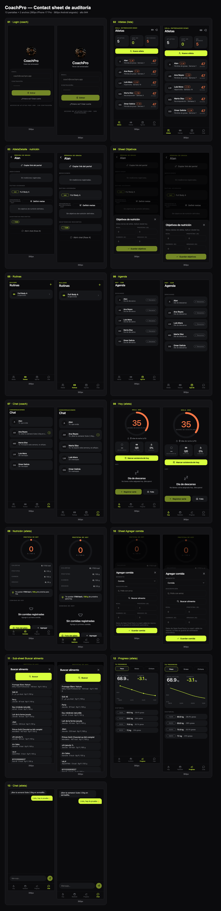

---

## Hallazgos globales

- **Scroll horizontal:** ❌ **ninguna** de las 13 pantallas se desborda, a 390px ni a 360px (`document.documentElement.scrollWidth === clientWidth` en las 26 capturas). El layout ya es fluido (`maxWidth: 520` + `width: 100%`, sin anchos fijos en px).
- **Uso de `vh`:** todo el código usa `100dvh` (la unidad correcta para móvil), **no** `100vh` crudo. Único `100vh` = fallback intencional en `index.html`. Detalle:
  | Archivo | Línea | Uso |
  |---|---|---|
  | `index.html` | 22 | `min-height: 100vh; min-height: 100dvh;` (fallback → dvh) |
  | `index.html` | 23 | `#root { min-height: 100dvh; }` |
  | `src/lib/ui.jsx` | 23 | `Screen` → `minHeight: '100dvh'` |
  | `src/lib/ui.jsx` | 414 | `Sheet` → `maxHeight: calc(100dvh - env(safe-area-inset-top) - lg)` |
  | `src/lib/ErrorBoundary.jsx` | 28 | `minHeight: '100dvh'` |
  | `src/pages/atleta/Portal.jsx` | 28 | chat: `height: '100dvh'` |
  | `src/pages/coach/ChatCoach.jsx` | 43 | chat: `height: '100dvh'` |
- **BottomNav:** 4 tabs, cada botón **90×59px** a 360px → **≥44×44 ✓**. Ícono + label completos, sin apretarse. Estado activo (**electric lime**) claramente distinto del inactivo (gris). Fondo glass `rgba(11,11,13,0.92)`.
- **Header:** la raíz (`html`/`#root`/`Screen`) es charcoal `#0B0B0D`, así que el área superior se ve charcoal **hasta el borde**. El contenedor de `Header` lleva `backgroundColor:#0B0B0D` + `paddingTop: env(safe-area-inset-top)` (en navegador normal el inset = 0; solo agrega espacio en standalone/notch). Título alineado a la izquierda con overline lima encima.
- **Touch targets:** nav 90×59 ✓; botones de acción 294–312×44–46 ✓ (todos ≥44×44).
- **Contenido vs nav:** la raíz scrolleable tiene `paddingBottom: 96px` y el nav mide 60px (top=784, viewport=844) → el último elemento **nunca** queda tapado.

> **Caveat de medición:** el script localiza el "header" vía `h1.closest('div')`, que cae en el *wrapper del título* (transparente, hereda el charcoal de atrás), no en el contenedor externo del `Header` que sí tiene el `backgroundColor`. Por eso `measures.json` reporta `header.bg = rgba(0,0,0,0)`. El fondo charcoal real viene de la raíz; verificado en código (`src/lib/ui.jsx:283`).

---

## Pantallas

### 1. Login (coach)
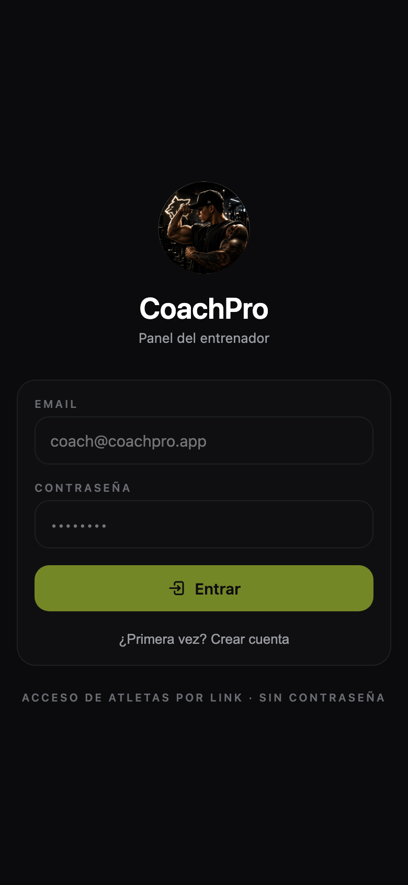 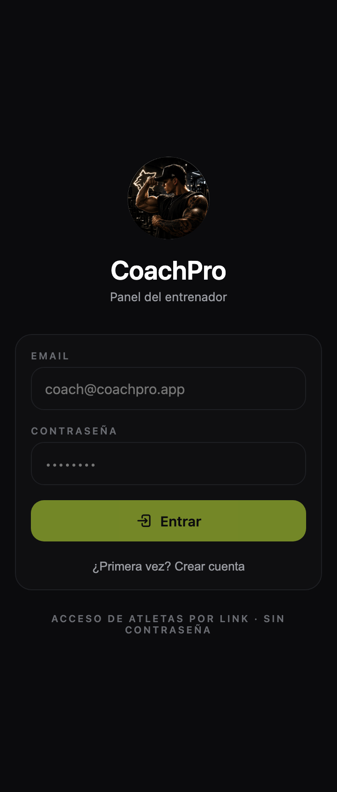

1. **Scroll horizontal:** no (390/390, 360/360).
2. **100vh:** hereda `Screen` (`100dvh`). Sin `vh` crudo.
3. **Header:** no usa el componente `Header` (layout centrado propio). Fondo charcoal completo; logo + título "CoachPro" + "Panel del entrenador" centrados.
4. **BottomNav:** N/A (login sin nav).
5. **Contenido inferior:** tarjeta de login centrada verticalmente, sin riesgo de corte.
6. **Sheets:** N/A.
7. **Touch targets:** botón **"Entrar" 294×44 ✓**, visible.

---

### 2. Tab Atletas (lista)
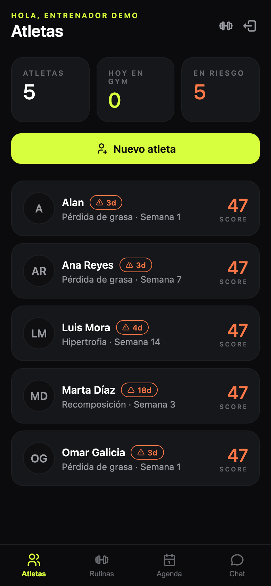 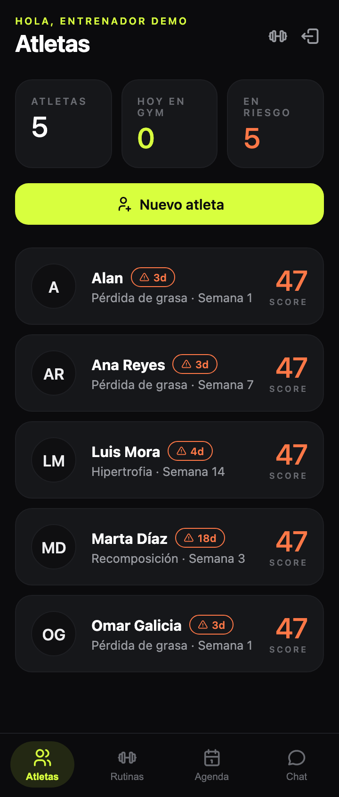

1. **Scroll horizontal:** no.
2. **100vh:** `Screen` → `100dvh`.
3. **Header:** "Atletas" + overline "HOLA, ENTRENADOR DEMO" (lima) + 2 íconos arriba-derecha. Charcoal hasta el borde, título bien centrado vertical. ✓
4. **BottomNav:** 4 tabs 90×59 ✓, "Atletas" activo en lima, resto gris. ✓
5. **Contenido inferior:** 5 cards de atleta + padding 96px; último item ("Omar Galicia") libre del nav. ✓
6. **Sheets:** N/A.
7. **Touch targets:** cards de atleta grandes; "Nuevo atleta" full-width. nav ✓.

---

### 3. AtletaDetalle (Alan) — sección "Adherencia nutricional · hoy"
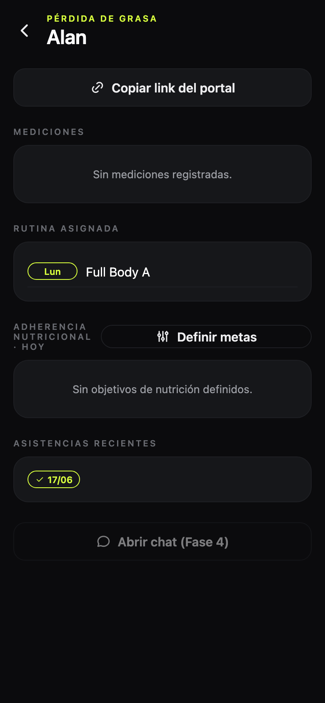 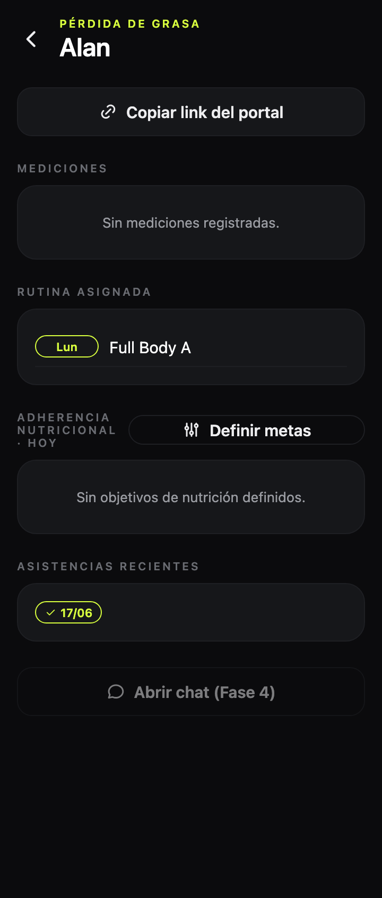

1. **Scroll horizontal:** no.
2. **100vh:** `Screen` → `100dvh`.
3. **Header:** "Alan" + overline "PÉRDIDA DE GRASA" + chevron de volver. Charcoal completo. ✓
4. **BottomNav:** N/A (es sub-pantalla con botón "volver", sin nav inferior).
5. **Contenido inferior:** "Abrir chat (Fase 4)" como último elemento, sin corte.
6. **Sheets:** N/A aquí (ver #4).
7. **Touch targets:** "Copiar link del portal" y "Definir metas" OK.

⚠️ **Hallazgo de responsividad:** el overline de sección **"ADHERENCIA NUTRICIONAL · HOY" envuelve a 3 líneas** y comparte fila con el botón **"Definir metas"**, lo que se ve apretado a 360px (y justo a 390px). El uppercase + letter-spacing del overline hace que un título largo no quepa junto a un botón en la misma fila. **Candidato a rediseño:** apilar título y acción, o acortar el label / mover la acción a un ícono.

---

### 4. Sheet "Objetivos de nutrición"
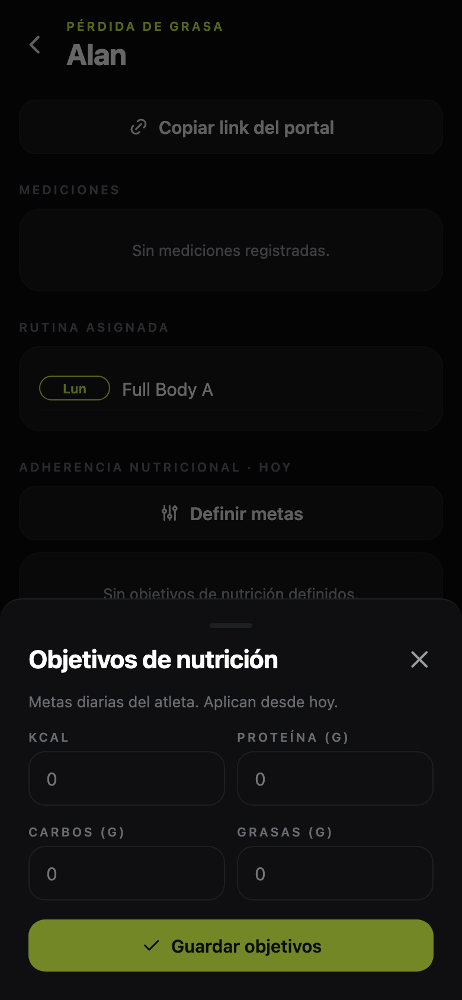 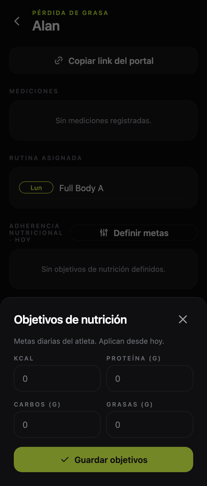

1. **Scroll horizontal:** no.
2. **100vh:** `Sheet` → `maxHeight: calc(100dvh - env(safe-area-inset-top) - lg)` (no invade el notch).
3. **Header:** detrás, atenuado por el backdrop.
4. **BottomNav:** N/A.
5. **Contenido inferior:** ✓.
6. **Sheet:** bottom-sheet con backdrop, grid 2×2 (Kcal/Proteína/Carbos/Grasas), respeta bordes laterales. Botón **"Guardar objetivos" 312×44 visible sin scroll**. ✓
7. **Touch targets:** "Guardar objetivos" 312×44 ✓; campos numéricos amplios.

---

### 5. Tab Rutinas
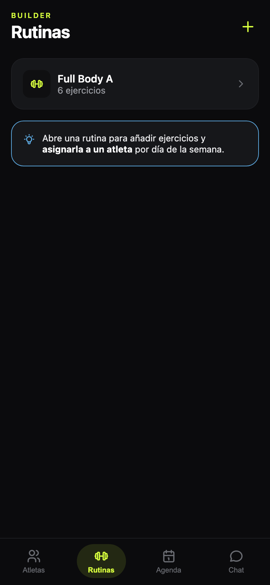 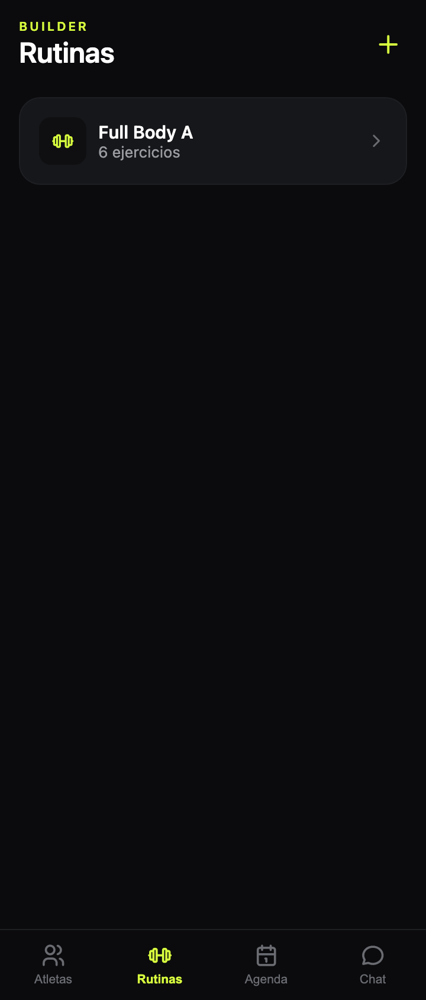

1. **Scroll horizontal:** no.
2. **100vh:** `Screen` → `100dvh`.
3. **Header:** "Rutinas" + overline "BUILDER" + "+" lima arriba-derecha. ✓
4. **BottomNav:** "Rutinas" activo lima. ✓
5. **Contenido inferior:** 1 card ("Full Body A · 6 ejercicios") y **mucho espacio vacío** debajo. Observación de diseño: pantalla muy vacía con poco contenido (oportunidad de empty-state / onboarding en el rediseño).
6. **Sheets:** N/A en esta vista.
7. **Touch targets:** card y "+" OK; nav ✓.

---

### 6. Tab Agenda
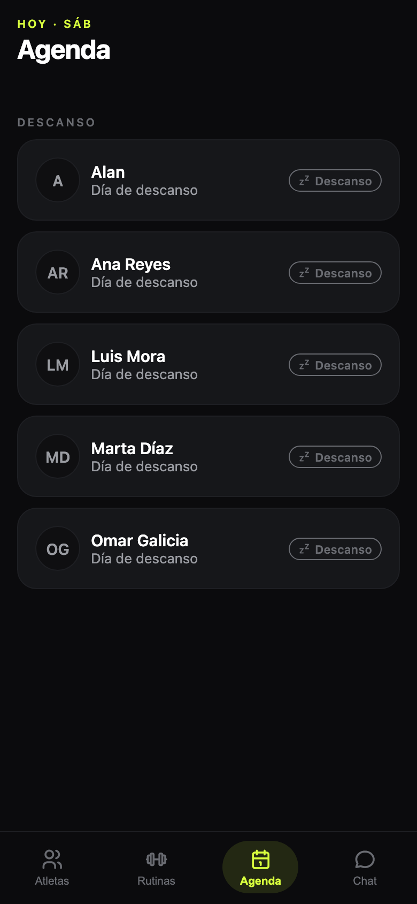 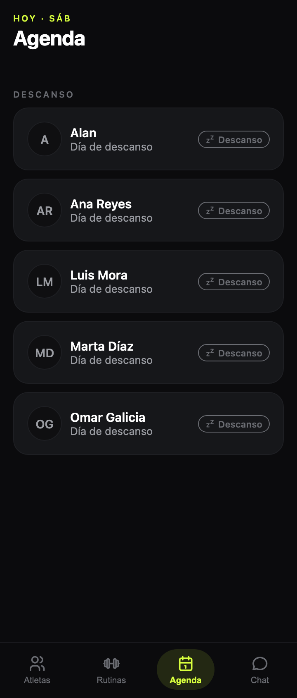

1. **Scroll horizontal:** no.
2. **100vh:** `Screen` → `100dvh`.
3. **Header:** "Agenda" + overline "Hoy · {fecha}". ✓
4. **BottomNav:** "Agenda" activo lima, 90×59 ✓.
5. **Contenido inferior:** lista de atletas del día + padding 96px → sin corte.
6. **Sheets:** N/A.
7. **Touch targets:** nav ✓.

---

### 7. Tab Chat (coach — conversaciones)
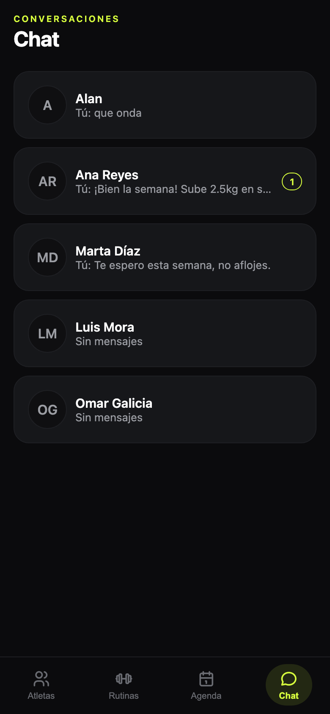 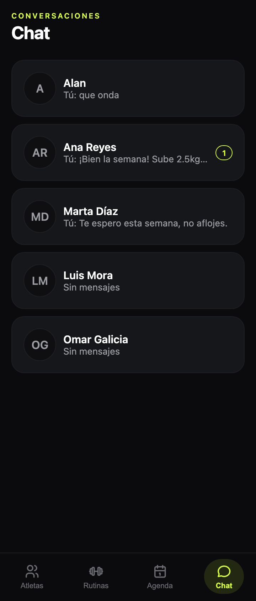

1. **Scroll horizontal:** no.
2. **100vh:** lista usa `Screen` (`100dvh`); el hilo abierto usa `height:100dvh` con `paddingBottom: calc(64px + safe-area)`.
3. **Header:** "Chat" + overline "Conversaciones". ✓
4. **BottomNav:** "Chat" activo lima. ✓
5. **Contenido inferior:** lista de conversaciones; padding 96px libra el nav.
6. **Sheets:** N/A.
7. **Touch targets:** cards de conversación grandes; nav ✓.

---

### 8. Portal atleta — Tab Hoy
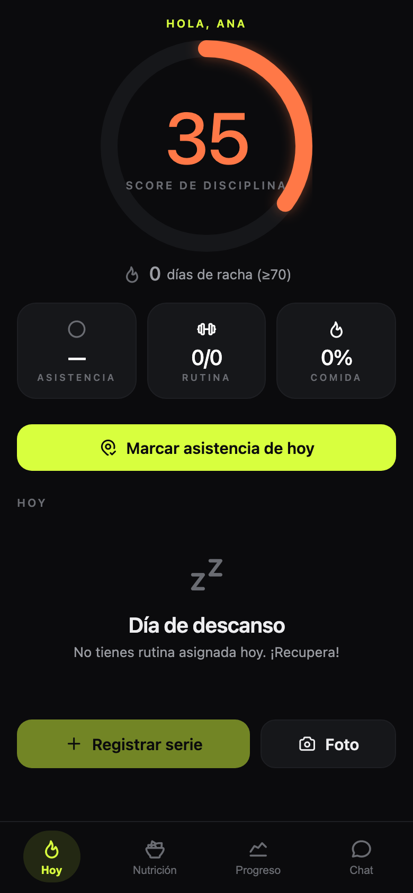 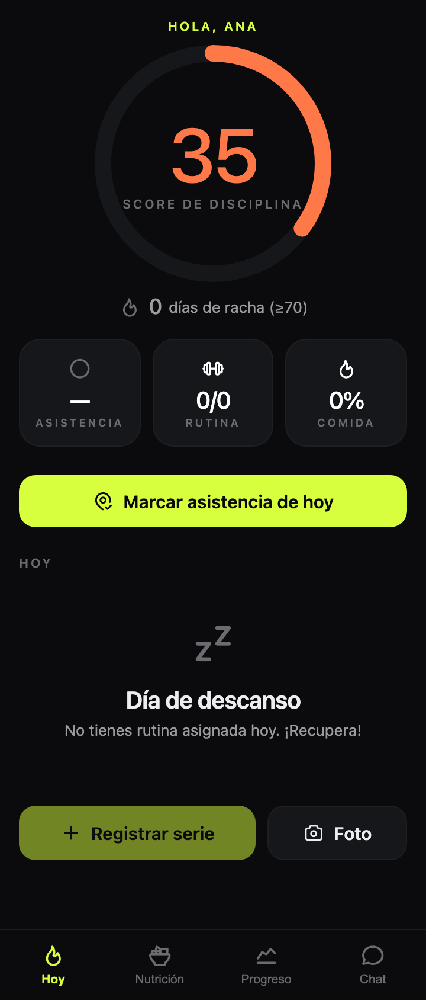

1. **Scroll horizontal:** no.
2. **100vh:** `Screen` → `100dvh`.
3. **Header:** sin `Header` clásico; overline "HOLA, ANA" + ring de Score centrado.
4. **BottomNav:** 4 tabs (Hoy/Nutrición/Progreso/Chat), "Hoy" activo lima. ✓
5. **Contenido inferior:** "Registrar serie" + "Foto" como última fila; padding 96px → sin corte. ✓
6. **Sheets:** N/A.
7. **Touch targets:** "Marcar asistencia" full-width; "Registrar serie"/"Foto" OK; nav ✓.

---

### 9. Portal atleta — Tab Nutrición
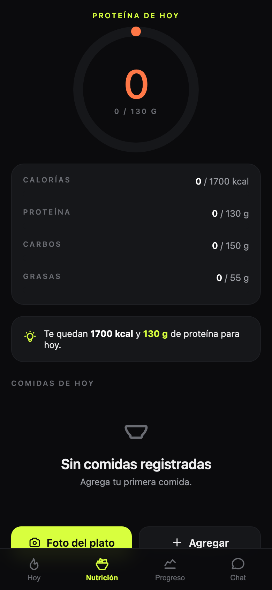 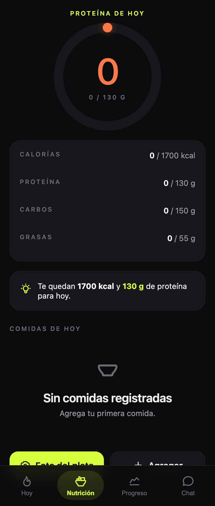

1. **Scroll horizontal:** no.
2. **100vh:** `Screen` → `100dvh`. Contenido scrolleable (`scrollHeight 895 > 844`), normal.
3. **Header:** anillo "Proteína de hoy" centrado (sin `Header` clásico).
4. **BottomNav:** "Nutrición" activo lima. ✓
5. **Contenido inferior:** "Foto del plato" / **"Agregar"** como última fila; padding 96px → libre del nav. ✓
6. **Sheets:** ver #10–11.
7. **Touch targets:** **"Agregar" 160×46 ✓**, visible; nav ✓.

---

### 10. Sheet "Agregar comida"
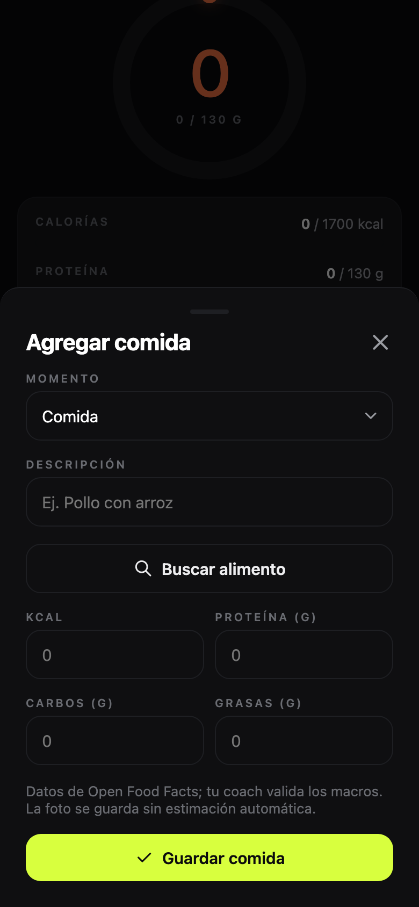 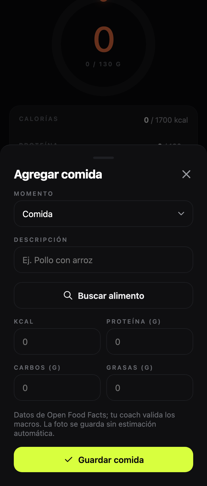

1. **Scroll horizontal:** no.
2. **100vh:** `Sheet` → `maxHeight: calc(100dvh - ...)`.
3. **Header:** detrás, atenuado.
4. **BottomNav:** detrás del sheet.
5. **Contenido inferior:** ✓.
6. **Sheet:** Momento (select) + Descripción + "Buscar alimento" + grid 2×2 + nota + **"Guardar comida" 312×44 visible sin scroll**. Respeta bordes. ✓
7. **Touch targets:** "Guardar comida" 312×44 ✓.

---

### 11. Sub-sheet "Buscar alimento" (resultados de "yogur griego")
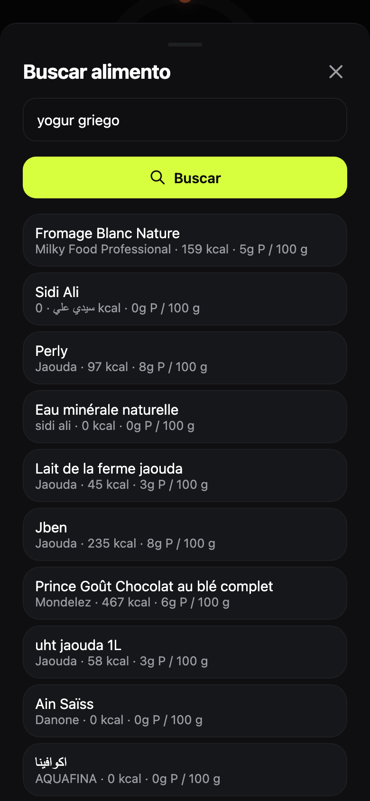 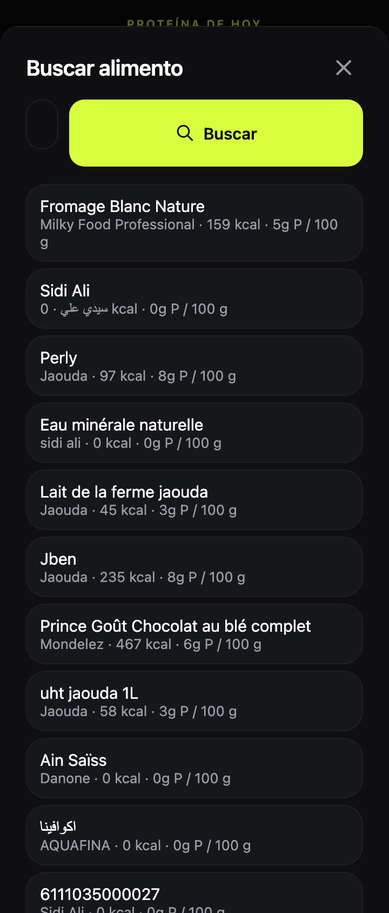

1. **Scroll horizontal:** no.
2. **100vh:** `Sheet` → `maxHeight: calc(100dvh - ...)`; lista de resultados con scroll interno.
3. **Header:** "Buscar alimento" + "×".
4. **BottomNav:** detrás.
5. **Contenido inferior:** lista larga de resultados, scroll interno del sheet. ✓
6. **Sheet:** respeta bordes; el botón final real **"Usar"** aparece *después* de elegir un alimento (esta captura es el estado de resultados). ⚠️ La fila **input de búsqueda + botón "Buscar" se ve apretada** a 360px (el campo queda corto junto al botón). Observación de **producto** (no layout): los resultados de Open Food Facts traen ruido internacional (marcas FR/AR, ítems con 0 kcal) → la relevancia podría mejorarse.
7. **Touch targets:** botón "Buscar" y cards de resultado OK. *(El `action` de `measures.json` aquí reporta "Agregar" 160×46 — es la página de Nutrición que queda detrás del overlay, no un botón del sub-sheet; artefacto de medición.)*

---

### 12. Portal atleta — Tab Progreso
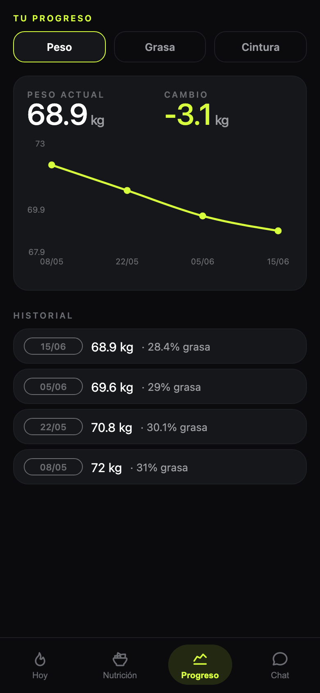 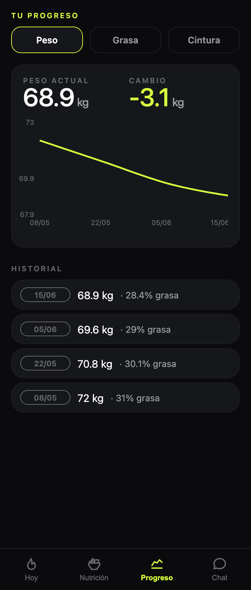

1. **Scroll horizontal:** no (el chart usa `ResponsiveContainer`, no desborda la página).
2. **100vh:** `Screen` → `100dvh`.
3. **Header:** overline "TU PROGRESO" + selector Peso/Grasa/Cintura.
4. **BottomNav:** "Progreso" activo lima. ✓
5. **Contenido inferior:** card del chart + historial; padding 96px → sin corte.
6. **Sheets:** N/A.
7. **Touch targets:** chips de métrica (Peso/Grasa/Cintura) OK; nav ✓.

⚠️ **Hallazgo menor:** la **última etiqueta del eje X del chart ("15/06") se recorta** en el borde derecho del card. Candidato a ajustar margen/padding del `ResponsiveContainer` en el rediseño.

---

### 13. Portal atleta — Tab Chat
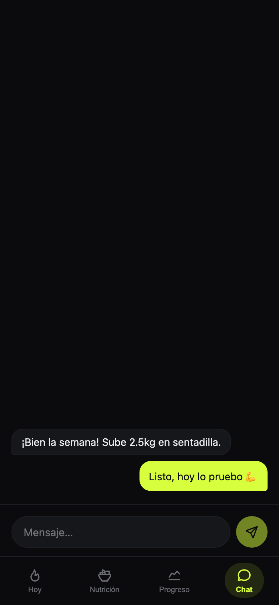 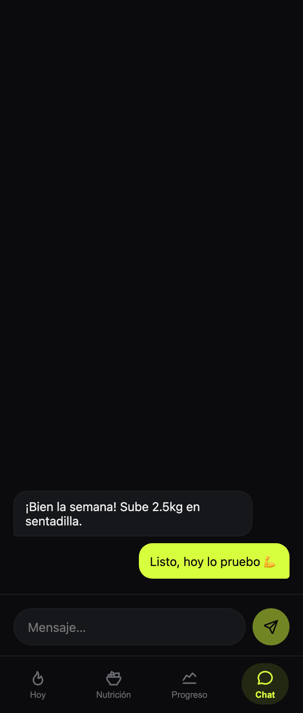

1. **Scroll horizontal:** no.
2. **100vh:** `Screen pad={false}` con `height:100dvh` + `paddingBottom: calc(64px + safe-area)`.
3. **Header:** hilo de mensajes (sin `Header` clásico en esta vista del atleta).
4. **BottomNav:** "Chat" activo lima; el **composer se ancla por encima del nav** (no queda tapado). ✓
5. **Contenido inferior:** input "Mensaje…" + botón enviar **44×44** sobre el nav. ✓
6. **Sheets:** N/A.
7. **Touch targets:** botón enviar 44×44 ✓; input amplio.

⚠️ **Hallazgo de diseño:** con pocos mensajes hay un **gran hueco vertical** entre las burbujas (ancladas arriba) y el composer (abajo). Candidato a anclar la conversación al fondo.

---

## Tabla resumen

| # | Pantalla | Scroll horizontal | Usa 100vh | Touch targets OK | Notas |
|---|---|---|---|---|---|
| 1 | Login | No | dvh (heredado) | ✓ "Entrar" 294×44 | Layout centrado, sin nav |
| 2 | Atletas (lista) | No | dvh | ✓ nav 90×59 | Estado activo lima claro |
| 3 | AtletaDetalle · nutrición | No | dvh | ✓ | ⚠️ overline "Adherencia nutricional" envuelve 3 líneas junto a "Definir metas" |
| 4 | Sheet Objetivos | No | dvh (sheet) | ✓ "Guardar objetivos" 312×44 | Botón final visible, respeta bordes |
| 5 | Rutinas | No | dvh | ✓ | Pantalla muy vacía con poco contenido |
| 6 | Agenda | No | dvh | ✓ nav 90×59 | OK |
| 7 | Chat (coach) | No | dvh | ✓ | OK |
| 8 | Hoy (atleta) | No | dvh | ✓ | OK |
| 9 | Nutrición (atleta) | No | dvh | ✓ "Agregar" 160×46 | OK |
| 10 | Sheet Agregar comida | No | dvh (sheet) | ✓ "Guardar comida" 312×44 | Botón final visible |
| 11 | Sub-sheet Buscar alimento | No | dvh (sheet) | ✓ | ⚠️ fila input+"Buscar" apretada; resultados OFF con ruido (producto) |
| 12 | Progreso (atleta) | No | dvh | ✓ | ⚠️ última etiqueta del eje X recortada |
| 13 | Chat (atleta) | No | dvh | ✓ enviar 44×44 | ⚠️ hueco vertical (mensajes anclados arriba) |

**Veredicto:** la responsividad base está **sana** — cero scroll horizontal, `dvh` en todo, safe-areas aplicadas, touch targets ≥44px, nav y sheets correctos a 360 y 390px. Los hallazgos para el rediseño son **refinamientos puntuales**, no roturas: (a) fila título+acción del detalle, (b) fila de búsqueda de alimento, (c) etiqueta de eje recortada en Progreso, (d) anclaje del chat, (e) densidad de contenido en Rutinas.

---

## Parte 4 — Fix del service worker (aplicado)

### Síntoma
La app colgaba al cargar en navegador normal (main thread congelado); solo cargaba en incógnito (sin SW cacheado).

### Causa
`registerType: 'autoUpdate'` en `vite-plugin-pwa`: al detectar un SW nuevo, hace `skipWaiting` + `clientsClaim` y **recarga la página automáticamente**. Combinado con un precache que aún apunta a assets hasheados viejos (que ya no existen tras un deploy), esto produce recargas en cadena / un cliente atrapado contra un SW en mal estado → cuelgue. En incógnito no hay SW previo, por eso ahí sí cargaba.

### Cambios
**`vite.config.js`:**
- `registerType: 'autoUpdate'` → **`'prompt'`**: el SW nuevo queda *en espera*; no se activa ni recarga solo.
- `injectRegister: 'auto'` (explícito): el registro lo hace el hook `useRegisterSW` en el bundle; verificado que **no** se inyecta un `registerSW.js` duplicado.
- `workbox.cleanupOutdatedCaches: true`: purga precaches viejos → un usuario con SW anterior no se queda con assets que ya no existen.
- `workbox.clientsClaim: true`: el SW nuevo toma control de las pestañas al activarse (tras la confirmación del usuario).
- **No** se activó `skipWaiting` automático; en el `dist/sw.js` generado, `skipWaiting()` queda detrás del mensaje `SKIP_WAITING` (lo dispara el botón "Actualizar").

**`src/lib/pwa.jsx`:** nuevo componente `ReloadPrompt` con `useRegisterSW` (`virtual:pwa-register/react`). Cuando hay versión nueva, muestra un aviso fijo arriba ("Nueva versión disponible") con botón **"Actualizar"** → `updateServiceWorker(true)` (skipWaiting + recarga controlada). Respeta `env(safe-area-inset-top)` y la paleta (charcoal/lime).

**`src/main.jsx`:** monta `<ReloadPrompt />` en la raíz, dentro del `ErrorBoundary`.

### Por qué resuelve el cuelgue
- El SW nuevo **nunca recarga solo** → se elimina el loop de recarga.
- `cleanupOutdatedCaches` borra el precache viejo → el usuario con SW anterior recibe la versión nueva limpia, sin assets fantasma.
- La actualización es **explícita** (un tap), predecible y reversible.

Verificado en `dist/sw.js`: `cleanupOutdatedCaches`, `clientsClaim` y `SKIP_WAITING` (gated) presentes. Build limpio; deploy a Vercel tras el fix.
